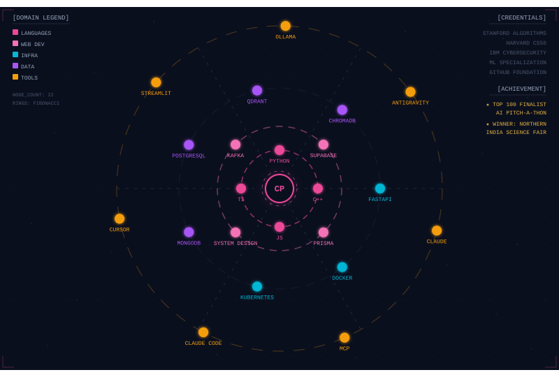

  
   

  

  
  
  

 

<!-- Plain-text about — always visible even without SVG rendering -->

  <strong>Adnan Khan</strong> · Coding-Philic 
  <strong>Frontend Developer</strong> · building multi-agent systems, RAG pipelines, and LLM evals at <strong>Spectatr AI</strong> 
  HTML · CSS · JavaScript · React 
  Lucknow, India 
  <em>Google GenAI Exchange Hackathon Winner</em> 

 

  

  

 

  

  

 

  

  

 

  

  
   
  
   
  
   
  
   
  
   
  
    
  

 

  

### // The Build Philosophy

The tools I can't stop thinking about share one property: they make complex systems feel deceptively simple. The interface shouldn't just be a wrapper around a model—it should communicate intent. The experience is inseparable from the function.

Most software solves the problem and calls it done. I want the version that also makes you go *oh, this was built by someone who cares about the human on the other side of the screen.*

That means different things depending on what I'm building:

| If it's a **frontend interface** | The browser is my canvas. Dense information needs to be legible, interactions need to be snappy, and the palette must be deliberate. If it feels like magic, the UI is doing its job. |
| :--- | :--- |
| If it's a **multi-agent system** | It shouldn't just run; it should be transparent. Users should be able to watch it think, understand its memory writes, and trust its tool calls. Architecture is the product. |
| If it's an **AI pipeline (RAG)** | Accuracy is aesthetic. Watching a pipeline successfully separate signal from noise to retrieve the perfect context is incredibly satisfying. |
| If it's a **robust ecosystem** | Like building for healthcare or news validation—it has to be bulletproof. No drama, no surprises, just tools that stay out of the way and work every single time. |

The constraint I keep coming back to: **a beautiful thing that doesn't solve the problem is art. A solution that's ugly is a missed opportunity.** I want both, every time.

---

### ∞ The Eternal Curiosity Problem

I have a condition. It starts with one question: *how can we make this LLM evaluation faster?* Three hours later I'm deep into rendering engine source code, wondering if UI thread management has anything useful to say about multi-agent orchestration. (It does.)

Some rabbit holes I've genuinely gone down: how to perfectly synchronize micro-animations with asynchronous API responses &middot; whether human memory consolidation maps to RAG vector retrieval &middot; what makes a color palette *actually* good &middot; the dark art of making complex TypeScript types actually readable.

> *"The test of a first-rate intelligence is the ability to hold two opposed ideas in mind at the same time and still retain the ability to function."* - F. Scott Fitzgerald, unknowingly describing debugging a React hydration error at 2am.

 

  <picture>
    <source media="(prefers-color-scheme: dark)" srcset="https://raw.githubusercontent.com/Coding-Philic/Coding-Philic/output/snake.svg?palette=github-dark">
    <source media="(prefers-color-scheme: light)" srcset="https://raw.githubusercontent.com/Coding-Philic/Coding-Philic/output/snake.svg">
    
  </picture>

 

